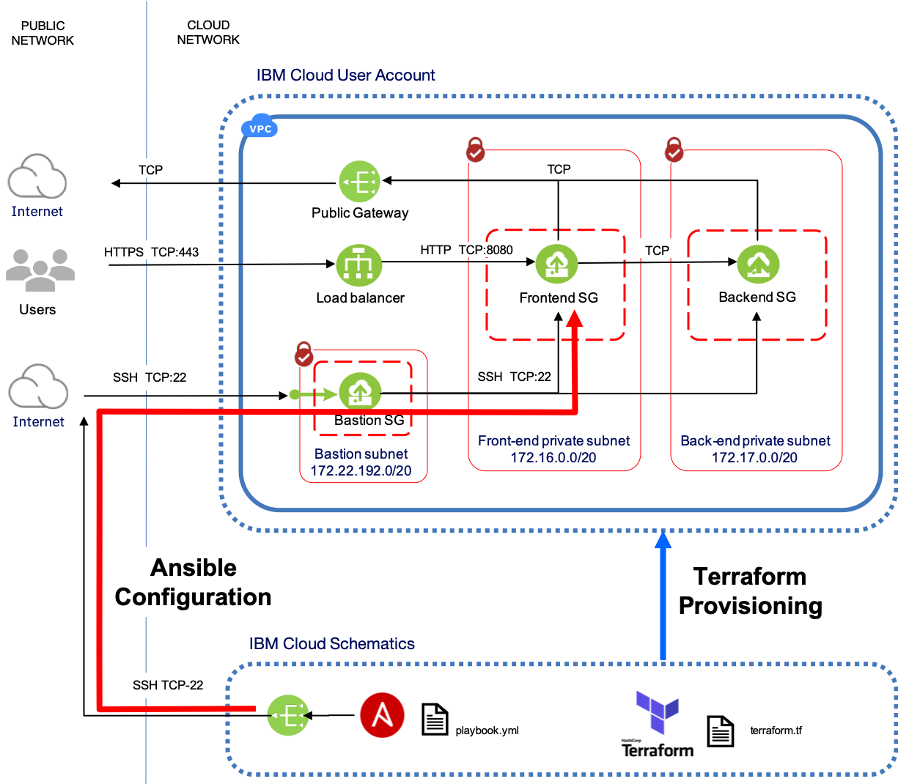

# Example of Application deployment with Redhat Ansible


This Terraform example for IBM Cloud Schematics illustrates how to use Redhat Ansible with Terraform and IBM Cloud Schematics to deploy multi-tier applications in an IBM Cloud Gen2 VPC environment.

The example makes use of out of the box Ansible roles to install the open-source [‘Hackathon Starter’]( https://github.com/sahat/hackathon-starter.git) application. It deploys the application onto a pair of ‘frontend’ nginx app servers and deploys mongodb as a ‘backend’ database server. It assumes that a suitable target VPC environment has been deployed using the example [Multi-tier VPC with bastion host SSH access](https://github.com/stevestrutt/ssh-vpc-modules).

The Ansible provisioner template described in this tutorial requires only two inputs. The private SSH key for the bastion host and VSIs and also the workspace_id of the Workspace used to deploy the VPC environment. The private key is the private key generated in the [Multi-tier VPC with bastion host SSH access](https://github.com/stevestrutt/ssh-vpc-modules) example.




Upon successful execution, which will take 10 to 15 minutes, the Hackathon Starter website will be accessible at the DNS address of the VPC load balancer.

This example was written for use with IBM Cloud Schematics, therefore the provider block does not include an API Key. To run standalone with Terraform, modify the example to input your IBM Cloud API key as an input variable.

For a detailed explanation of how to use and configure the Terraform Ansible provisioner, please see the IBM Developer article
[Application deployment with Redhat Ansible and IBM Cloud Schematics]().


## Requirements


|  **Name**                  | **Version** |
|  --------------------------| -------------|
|  terraform                 | ~> 0.12 |
|  terraform_provisioner_ansible | ~> 2.3.3 |
|  terraform_provider_ibm    | ~> 1.5.2 |


## Inputs

| name | description | type | required | default |
| ------------------------- | ---------------------------------------------------------------------------------------------------------------------------------- | -------------- | ---------- | ------------------------------------ |
|  workspace_id | Id of the source Schematics Workspace for target VSIs |  string |  ✓   |       |
|  ssh_private_key | Optional private key from key pair. Only required if it desired to validate remote SSH access to the bastion host and VSIs. | string  |  ✓ |              |

## Outputs

|  **name**      |    **description**  |
|  --------------------------------------- | ------------------------------------------- |
|  app_dns_hostname             |     Fully qualified DNS name for application access |


## Instructions

1. Deploy the VPC target environment as described in the example [Multi-tier VPC with bastion host SSH access](https://github.com/stevestrutt/ssh-vpc-modules)
2. Copy and save the workspace_id of the Workspace created to deploy the VPC environment. The workspace_id will be located under the heading **Workspace ID** on the Settings page of the VPC workspace.
3. Make sure that you are [assigned the correct permissions](https://cloud.ibm.com/docs/schematics?topic=schematics-access) to create workspaces and deploy resources.
4.  Create the Schematics provisioner workspace:
   1.  From the IBM Cloud menu
    select [Schematics](https://cloud.ibm.com/schematics/overview).
       - Click **Create workspace**.   
       - Enter a name for your workspace.   
       - Click **Create** to create your workspace.
    2.  On the workspace **Settings** page, enter the URL of this example from the Schematics examples Github repository.
     - Select the Terraform version: Terraform 0.12.
     - Click **Save template information**.
     - In the **Input variables** section,  The only two parameters are:
         - workspace_id of the VPC workspace
         - private SSH key generated for the VPC workspace  

      - Click **Save changes**.

5.  From the workspace **Settings** page, click **Generate plan** 
6.  Click **View log** to review the log files of your Terraform
    execution plan.
7.  Apply your Terraform template by clicking **Apply plan**.
8.  Review the log file to ensure that no errors occurred during the
    provisioning process.

The output of the Schematics Apply Plan will list the fully qualified DNS name of the hosted instance of the Hackathon Starter application.

```
Outputs:


```

Open a web browser, copy the app_dns_hostname URL from the Schematics output and paste into the browser. The splash screen of the Hackathon Starter application should be displayed.
